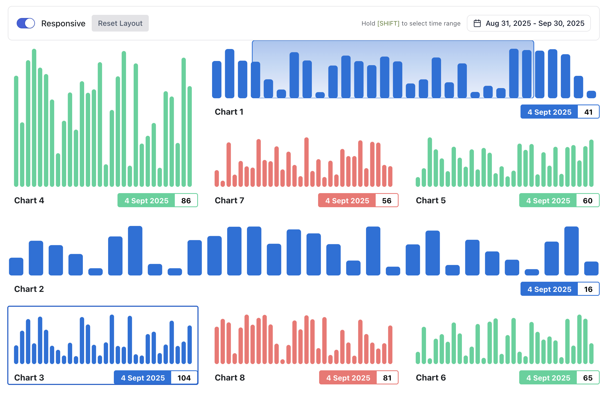

# Snap Dash

A React-based dashboard application for displaying multiple time series charts with advanced interactivity and flexible layouts. Built to explore modern dashboard development tools and patterns.



## Features

### Multiple Layout Modes

- **Vertical Layout**: All charts stacked in a vertical column, each taking full viewport width
- **Grid Layout**: Responsive 3x3 grid that collapses to vertical on narrow viewports
- **Free Layout**: Drag-and-drop positioning with resize handles, similar to Grafana
  - Resize charts via bottom-right corner handles
  - Drag to reposition anywhere on the dashboard
  - Intelligent flow prevents chart overlaps
  - Persistent layout storage in localStorage

### Chart Interactivity

- **Synchronized Hover**: Hovering over any chart creates hover points at the same X-axis position across all charts
- **Date Range Selection**: Select date ranges via the date picker or click-drag within any chart
- **Responsive Scaling**: Charts scale appropriately during resize/reposition while maintaining readability
- **Mock Time Series Data**: Fully mocked data generation for development and testing

## Tech Stack

- **React 18** with TypeScript
- **Vite** for fast development and optimized builds
- **Custom SVG Charts** - No external charting library dependencies
- **React Context API** for state management
- **CSS Modules** for component styling
- **Radix UI** for accessible UI components

## Development

```bash
# Install dependencies
npm install

# Start development server
npm run dev

# Type check and build
npm run build

# Lint code
npm run lint

# Preview production build
npm run preview
```

## Project Structure

```
src/
├── features/dashboard/  # Main dashboard container
├── components/          # UI components (charts, layout, interactions)
├── lib/
│   ├── contexts/       # React Context providers
│   ├── hooks/          # Custom React hooks
│   └── utils/          # Utility functions
└── assets/             # Static assets
```

## Architecture

The application uses React Context API for global state management:

- **DateRangeContext**: Manages date range selection and synchronized hover state
- **GridLayoutContext**: Manages layout modes and chart positions/dimensions

Chart rendering is handled by custom SVG-based components with an interactive overlay layer for hover and drag-to-select functionality.
